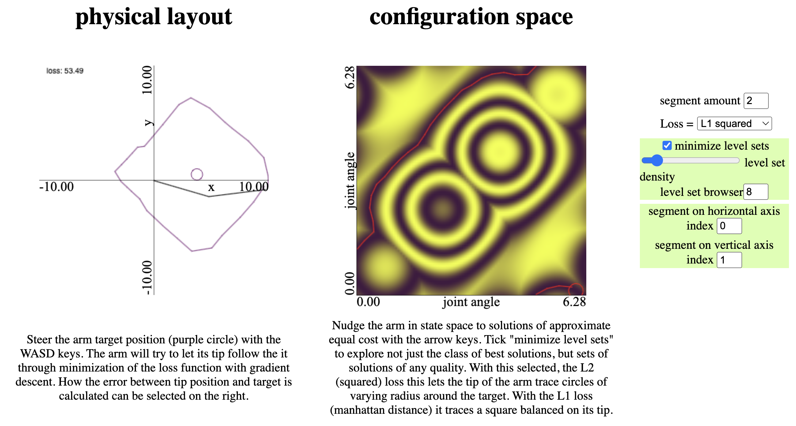

# Configuration space visualization of arm with n-segments
There are two "modes" associated with this visualization, RRT* / planning mode, and gradient mode. They can be switched between on the top left dropdown in the browser. Here I will present the two modes briefly:

## Navigation function visualization, gradient descent, and gradient descent on level sets of navigation function (this is very interesting behaviour!).
In this mode
On the right plot we see level sets of the loss function (smoothed, by taking a periodic trigonometric function of the cost/loss function). In this screenshot, the loss is the squared manhattan distance between the end-effector and the target (red circle on the left plot). If we move through the configuration space along the valley of the level set of the manhattan distance (see red trail on the right), we can see that the end-effector traces out a $45^\text{o}$ rotated square. 

Moving along a different level set like the following one will trace a different partial square, because the arm is not long enough to trace out the remainder. It is quite interesting to play around with this and explore different neighboring configurations that lead to the same cost.

## Free space visualization with built-in RRT* planner (no tracking / controller)
On the left, we see the arm (2 segments, rooted at origin) and circular obstacles. The small red circle on the left is the target region that the end-effector should enter. On the right, we see the configuration space of the arm ($\theta_1, \theta_2$) and in purple/yellow free/colliding configurations, respectively. We can also see the tree generated by a run of RRT* from start to end, tracing a red path through configuration space that could be tracked to move the arm to the destination.

Below is another run from a different starting configuration to a similar target position.

## Why?
It was a hobby project to visualize and explore interesting quantities and play around with browser stuff. RRT* is slowed down on purpose so it can be seen exploring.